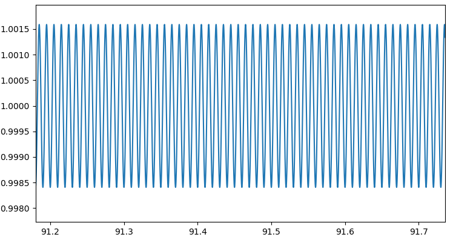
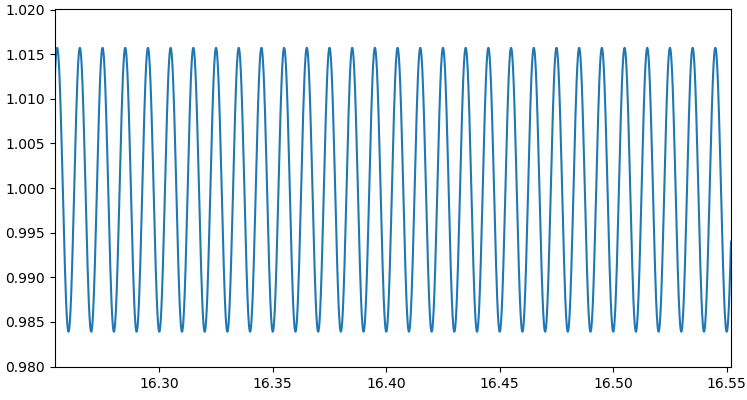
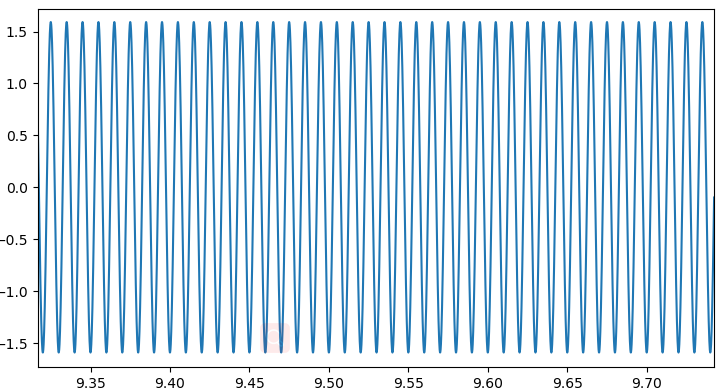
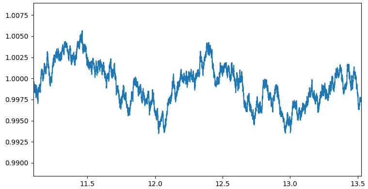
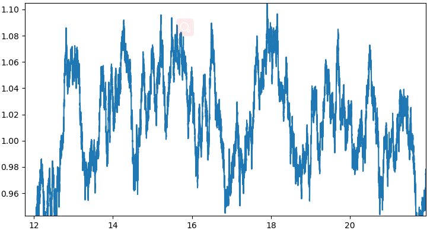
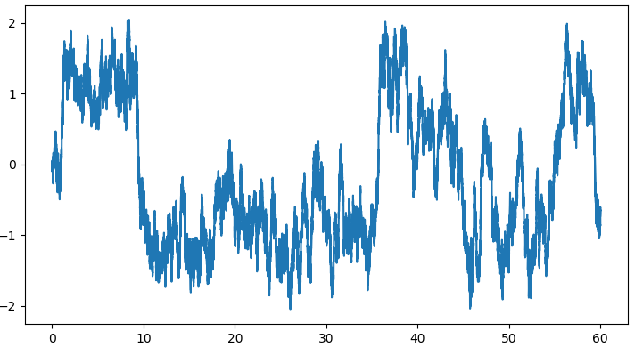
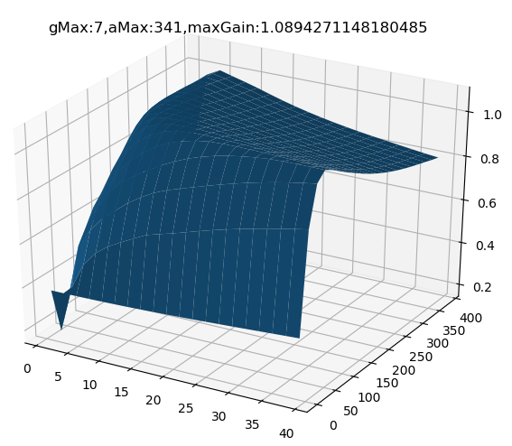

### 2019.11.10
随机共振的动力学描述如下，当$x=\sqrt{\frac{a}{b}}或x=-\sqrt{\frac{a}{b}}$，$ax-bx^3=0$,当$s(t)+n(t)$的幅度没有特别大的情况下，如果$s(t)+n(t)>0$,短时间$x$会递增，但很快$-bx^3$会起作用使$x$得导数变为负数，使$x$的输出降下来，此时$x$会在正稳态点$\sqrt{\frac{a}{b}}$附近小幅度震荡。在负稳态点处同理。随机共振系统可以将高频能量向低频能量转移，个人认为是在解微分方程的时候，对原信号的积分导致的这一现象，对于一直波动的信号，积分后信号的变化频率不会快于原信号变化的频率。
$$x^{'}=ax-bx^3+s(t)+n(t)$$
下面探索输入信号幅度与随机共振震荡之间的关系:
##### 只有信号时
输入信号幅度1：

输入信号幅度10：

输入信号幅度100：

输入信号幅度1000(已经开始震荡)：

##### 只有噪声时
注：randn()为-1到1 之间的随机数
输入信号为randn() * 1

输入信号为randn() * 10

输入信号为randn() * 100(开始震荡)

从上面的实验结果来看，随机共振系统的震荡需要输入信号的幅度达到一定的值，根据查阅的资料幅度阈值为
$$A_c=\sqrt{4a^3/27b}$$

目前的结果：
下图为扫描结构参数与信号幅度得到的增益图，目前扫描得到的最优参数的输出信噪比增益为1.08增益不是特别大。

### 关于时间长度对于信号检测性能影响的分析
FFT公式:
$$X(k)=\sum^N_nx(n)e^{-j\frac{2\pi nk}{NFFT}}.$$
因此，FFT谱图的值与时间长度$N$有关，为了消除谱图的幅度值与时间长度的关系，将$X(k)/N$作为观测量，这样做不影响信号与噪声在频域的相对值。

根据帕萨瓦尔定理有，
$$\sum_n^{N}{x(n)^2}=\frac{1}{N}\sum_k^{N}{X(k)^2},$$
这里$NFFT=N$，也就是充分采样。

当时间增加为G倍时，$\sum_k^{N}{X(k)^2}$变为$G^2$倍，对于噪声而言，能量均摊于整个频域轴，频域幅值变为${\sqrt{G}}$。

对于噪声而言，频域能量均摊于整个频率轴，时间增加为$G$倍时，频域的幅值变为${\sqrt{G}}$,对于我们观测的谱幅值则变为${{\sqrt{G}}}$，对于我们观测的谱噪声谱的幅度变为$\frac{1}{\sqrt{G}}$。对于信号而言，由于只有一个频点有值，信号对应频点的幅值变为$G$倍，而对于我们观测的谱信号的幅值是不会随时间长度改变的。

##### 结论：
采样点数变为$G$倍,在频域$\frac{信号频点幅度}{噪声均值幅度}$变为$\sqrt{G}$倍，从经验上看$\frac{信号频点幅度}{噪声均值幅度}>=4$时，信号能较为明显的被检测出来。

### 关于滑动窗叠加法对信号检测性能影响的分析
#### 在相邻滑动窗没有重叠的时

假如信号被分为$L$段,对于噪声，每段信号与原信号相比噪声谱幅度变为$\sqrt{L}$倍，同时，由于每个窗之间的噪声是不相关的，因此L段噪声叠加后能量变为$L$倍，因此噪声谱需要再乘一个$\sqrt{L}$，因此叠加谱的噪声幅度为未叠加的L倍。

对于信号，假设每一段的信号同步，那么信号谱是同相相加，$L$个谱图叠加后信号谱幅度变为$L$倍。

##### 结论：
在这种情况下，信号和噪声谱都变成了原来的$L$倍，因此理论上，在每个窗信号都同步的其情况下，信号分为几段对信号检测是没有影响的，可能会造成的影响是采样点没有充分利用或者窗与窗之间信号不同步时会使信号更不容易被检测出来(后者可以使用相位补偿解决)。

#### 在相邻滑动窗有重叠的时
在相邻滑动窗有重叠的时候，相邻的两个窗如下图所示，相位补偿后在时域中相当于将$[A,B]$与$[B,C]$累积变为$[A,B]$与$[C,B]$进行累积，这样操作之后可以使得信号与第1个窗的信号相位对齐，使之不至于在叠加过程中相互抵消。

对于整个序列的N个点，只要被滑动窗覆盖到就会参与1次累积，在滑动窗滑动的过程中，如果抛开头部和尾部一些数据点，在窗口长度远大于步进长度的时候，信号中间部分点被滑动窗覆盖过的次数应该是近乎相等的(大概为$\frac{窗口长度}{步进长度}$)，并且这些点在参与累积的时候反映到一个窗内的位置是一样的，因此，如果忽略头部和尾部的少量数据点，这种方法应该与将原有信号周期延拓$\frac{窗口长度}{步进长度}$次的不重叠滑动窗累积法性能相近。

##### 结论：
在滑动步长远小于窗口长度的时，性能近似于对信号进行$\frac{窗口长度}{步进长度}$次周期延拓后的不重叠滑动窗累积。

#### 思考
经上述分析，能提高检测性能的是增加采样点数，这样可以减小频域分辨率，而噪声在一个频域分辨率上积分的能量就会变小，相应的在数字谱中，噪声谱就会降低，而这对于单频点的信号影响是没有影响的，因此可以使得信号更容易被检测出来。同时，假如我们20分钟的数据可以检测-48db的信号的话，通过解$\sqrt{G}=10^{\frac{60-48}{20}}$，可知理论上使用$20*10^{1.2}$约为317分钟的数据可以检测-60db的信号。

定义低通滤波器截止频率为$f_p$,
$$能量=\frac{1}{N}\sum^NX(k)^2,$$
$$信号能量=\frac{1}{N}*X_{信号}(\frac{信号频率}{频域分辨率})^2,$$
$$噪声能量=\frac{1}{N}*\sum_k^{\frac{f_p}{频域分辨率}}X_{噪声}(k)^2\approx\frac{1}{N}*\frac{f_p}{频域分辨率}*mean(X_{噪声})^2.$$
根据上式，定义$r=\frac{X_{信号}(\frac{信号频率}{频域分辨率})}{mean(X_{噪声})}$结合信噪比公式有，
$$10^{\frac{SNR}{10}}=r^2*\frac{频域分辨率}{f_p}=r^2*\frac{Fs}{N*f_p}=\frac{r^2}{t*f_p},$$
其中，$t$为以秒为单位的时长，整理上式有，
$$r^2=10^{\frac{SNR}{10}}tf_p$$
